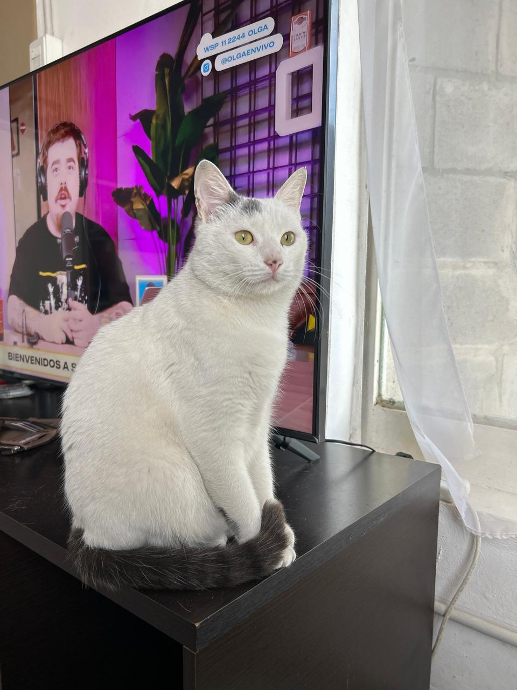
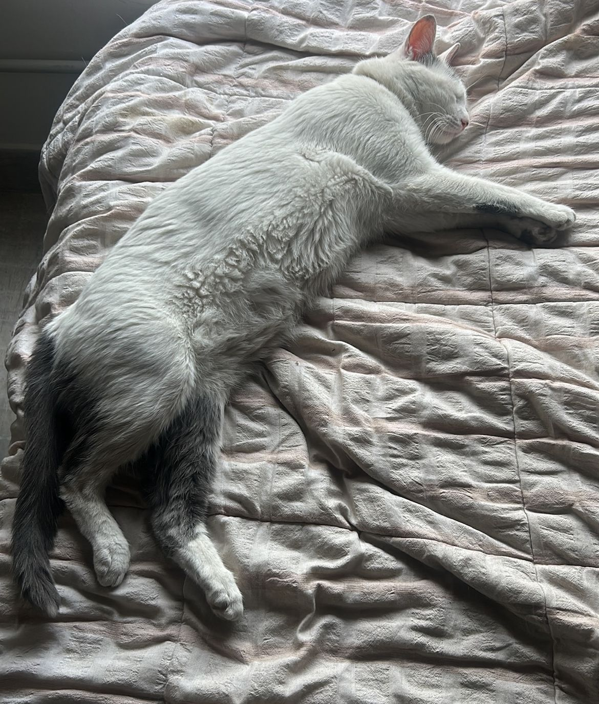
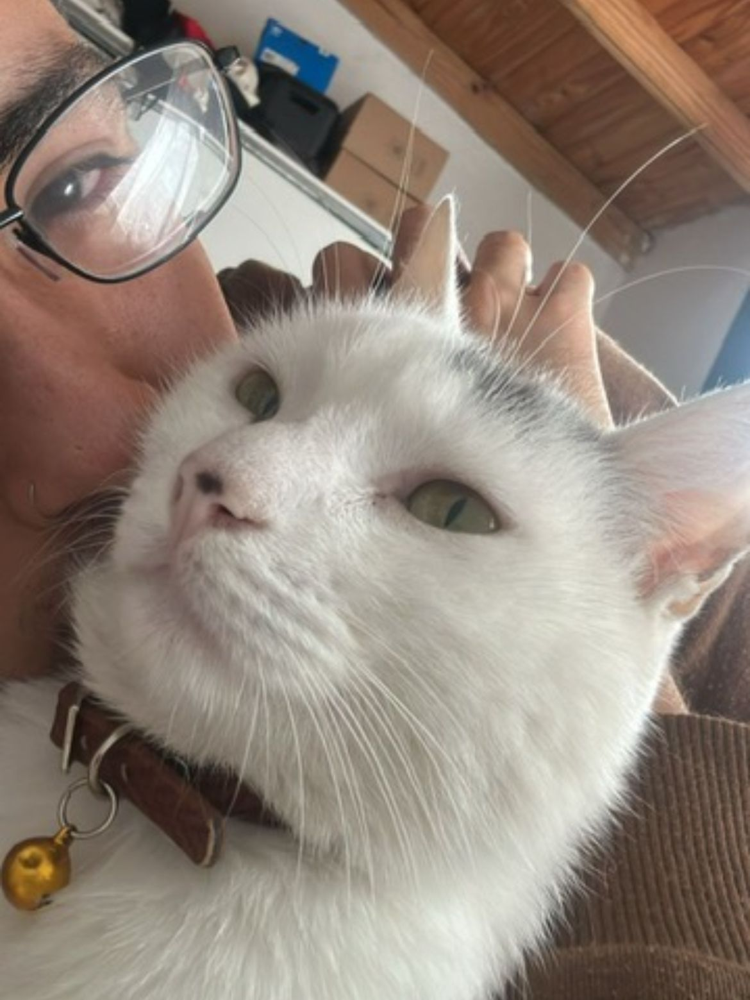

# Presentación personal - PdP (Tarde pero seguro :D ) #  

Alumno: Gastón Robledo  
Legajo: 213.413-5  

   

## Sobre mi ##  

Me llamo Gastón Robledo, tengo 25 años y actualmente curso materias de segundo año en Ingeniería en Sistemas de Información en la UTN y trabajo en telecomunicaciones, donde aplico y amplío mis conocimientos prácticos.

Soy técnico electrónico recibido de E.E.S.TN°5 de Tigre y siempre se me dieron mejor las ciencias formales, aunque al principio no tenía intención de estudiar nada relacionado con tecnología :p .

Tengo muchas ganas de aprender y me interesa profundizar en programación, aunque reconozco que todavía no es mi punto fuerte. Busco aprovechar cada oportunidad para crecer en la carrera y fortalecer mis habilidades técnicas, combinando la práctica con la teoría.    

## Dato curioso ##

Tengo un gato que se llama Mateo , el cual me acompaña siempre que estoy estudiando o trabajando es una de mis mejores compañias <3

  
  
  

